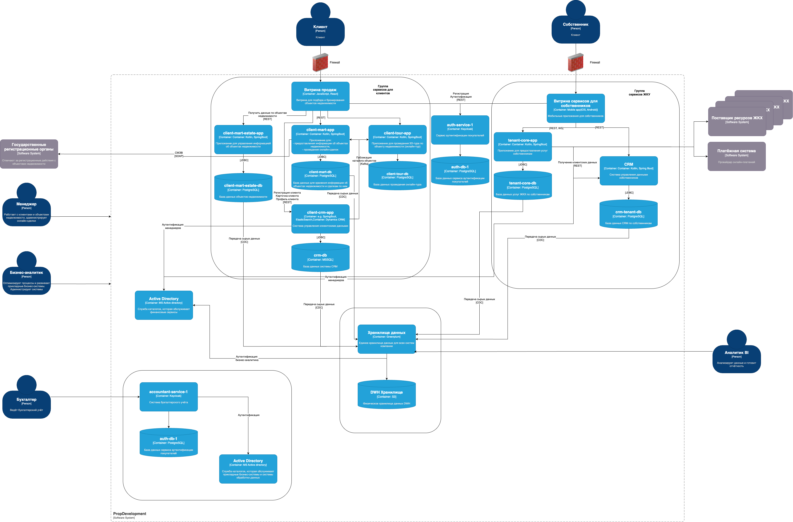

# Безопасность: соответствие требованиям, проектирование, аудит

## Архитектура информационной системы компании      
Структура системы состоит из 4 доменов:     
- Группа сервисов для работы с клиентами        
- Группа сервисов ЖКУ  
- Система финансового учета    
- Система обработки данных      

## [Разработка проверочного листа по безопасности данных](Task1/Разработка_проверочного_листа_по_безопасности_данных.md)
## [Разработка и заполнение проверочного листа для бизнес-систем](Task2/Разработка_и_заполнение_проверочного_листа_для_бизнес-систем.md)
## [Внешние интеграции](Task3/Внешние_интеграции.md)
## [Защита доступа к кластеру Kubernetes](Task4/Защита_доступа_к_кластеру_Kubernetes.md)
## [Управление трафиком внутри кластера Kubernetes](Task5/Управление_трафиком_внутри_кластера_Kubernetes.md)