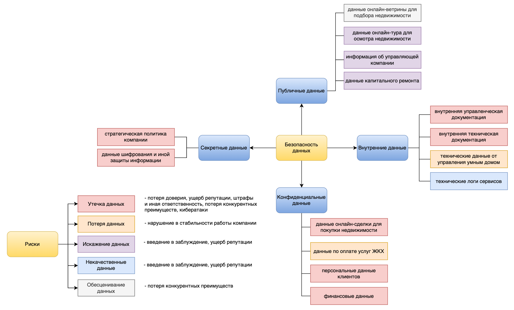

# Разработка проверочного листа по безопасности данных

По стандартам ISO/IEC 27001 и 27002 выделяются 4 категории данных:
- Публичные - информация, которая не подлежит ограничению, распространяется свободно(публичные оферты, пресс-релизы, реклама);   
- Внутренние - информация для внутреннего использования(внутренние инструкции, данные о работе информационных систем);      
- Конфиденциальные - информация, которая имеет высокую ценности и ограничена в распространении(персональные данные, коммерческая тайна);        
- Секретные - информация, утечка которой может привести к серьезному ущербу (гос.тайна, политика компании, платежные данные);   

К каждой категории относится класс данных. Из описания и анализа архитектуры и бизнес-процессов выявлены риски для каждого класса данных.       

