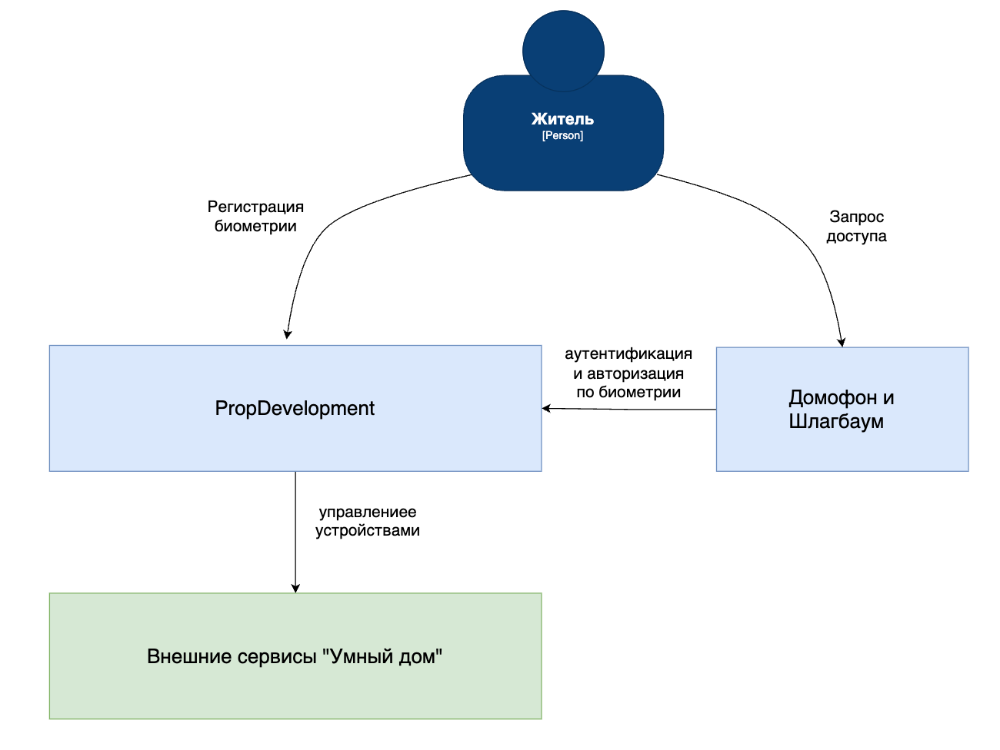
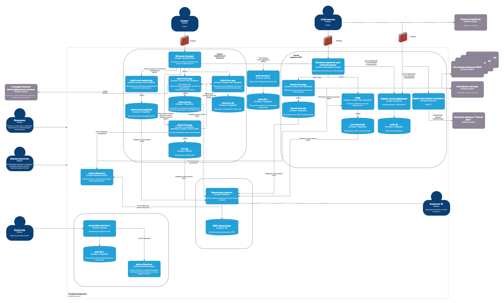

# Внешние интеграции

## Диаграмма контекста      
            

## Диаграмма контейнеров        
        

## Список требований безопасности, которым должны удовлетворять интеграции с внешними внешних сервисами         

Проектирование защиты от несанкционированного доступа основывается на **принципах**             
- конфиденциальности на основе категорий данных;      
- обеспечения целостности;        
- обеспечения доступности;    

Архитектура системы безопасности должна предусматривать средства контроля и ограничения доступа к данным 
на основе **аутентификации и авторизации** пользователей. 
Авторизация в системе строится по ролевой модели доступа RBAC, где каждый участник проекта имеет строго определённые права.     

Защита данных с помощью **шифрования**      
-на уровне приложения перед отправкой в хранилище и     
-при передаче между компонентами системы по защищенных протоколам.      

Для обнаружения попыток несанкционированного доступа, неправомерных действий пользователей и иных угроз, 
связанных с безопасностью данных и системы проводится **мониторинг** на основе логов **и аудит** 
на основе сообщений аудита по ключевым действия в системе.      

Для хранения ключей шифрования используется **Key Management System KMS,** которая позволяет хранить и управлять ключами 
в защищённой среде с регулярной **ротацией.**       

Настройка изоляции в **Kubernetes** с разграничением прав доступа на основе ролей пользователей и настройка изоляции подов.         